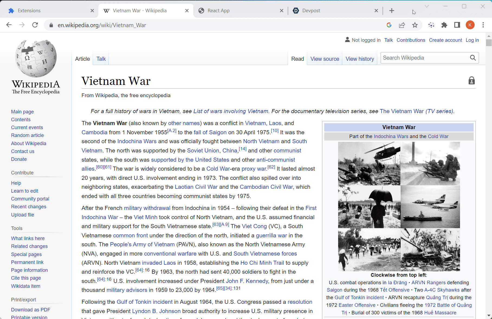

# Knowledge.Ai
Repository for NUS Hack&Roll 2023

## About the project

<a href="http://3.0.100.46:8000/"></a>
<a href="https://github.com/Ducksss/Project-Cactus/blob/main/README.md#browser-extension"></a>

Knowledge.Ai consists of a browser extension and web application with a NLP pipeline which accepts text input and extracts relations between entities to form a knowledge graph in order to create a cleaner and easy-to-understand visual representation of the long texts.

Knowledge.Ai is powered by a PyTorch model hosted on our custom AI server and deployed.

<p align="right">(<a href="#top">back to top</a>)</p>


### Built With

* [React](https://reactjs.org/)
* [PyTorch](https://pytorch.org/)
* [Hugging Face](https://huggingface.co/)
* [AWS EC2](https://aws.amazon.com/ec2/)
* [Django](https://www.djangoproject.com/)

<p align="right">(<a href="#top">back to top</a>)</p>


## Getting Started

Knowledge.Ai is accessible via two different methods, as a [Web Application](http://3.0.100.46:8000/) and a [Browser Extension](https://github.com/kritp03/HacknRoll2023/tree/main/extension-react).

### Web Application

1. Visit our [Demo Application](http://3.0.100.46:8000/).

### **or** Clone the repository.

1. Clone the repository
   ```sh
   git clone https://github.com/kritp03/HacknRoll2023.git
   ```
2. Cd into the frontend directory.
    ```sh
    cd frontend
    npm i
    npm start
    ```
3. Cd into the Django directory in a different terminal.
    ```sh
    cd frontend
    touch .env
    echo "REACT_APP_BACKEND_URL='http://localhost:8000/'" > .env
    cd ..
    cd KGEDjango
    python manage.py runserver
    ```

### Browser Extension

1. Clone the repo.
   ```sh
   git clone https://github.com/kritp03/HacknRoll2023.git
   ```
2. Visit the Extension Settings Page from your Chromium Browser.
   ```sh
   chrome://extensions/
   ```
3. Enable Developer Mode.
4. Load and Enable the extension from the `extension-built` folder in this repository.
5. Select a text, right click, press `generate` and start creating knowledge graphs.

<p align="right">(<a href="#top">back to top</a>)</p>


## What's Next for Knowledge.Ai
- Train on more sofisticated datasets
- Expand our use cases across different domains

<p align="right">(<a href="#top">back to top</a>)</p>


## Contact

- Ponyuenyong Kritchanat - (Full Stack AI Engineer) - [LinkedIn](https://www.linkedin.com/in/kritchanat/)

- Liaw Choon Wei - (Full Stack AI Engineer) - [LinkedIn](https://www.linkedin.com/in/lcw020104/)

- Shi Tingxiao - (Full Stack AI Engineer) - [LinkedIn](https://www.linkedin.com/in/tingxiaoshi/)


<p align="right">(<a href="#top">back to top</a>)</p>

<!-- References -->
## References

- [Wikidata](https://www.wikidata.org/wiki/Wikidata:Main_Page)
- [thunlp/OpenNRE](https://github.com/thunlp/OpenNRE)
- [rebel-dataset](https://huggingface.co/datasets/Babelscape/rebel-dataset)

<p align="right">(<a href="#top">back to top</a>)</p>